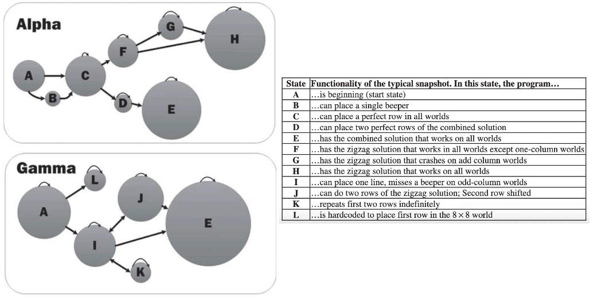

Assignments will be **manually graded**, and these grades will be entered on Canvas. The AutoHinter is just provided as an additional tool to help "nudge" you through assignments, providing hints wherever you may get stuck[^1]. Your workflow should look as follows, where you can use the AutoHinter as part of an "iterated development" process:

## Stage 0: Understanding the Response Cells

Before starting your work on an assignment, the main important thing to note is that **the AutoHinter infers which lines of code are associated with which questions** by looking at the **special "cell title" comment at the top of the response cells**: the comment on the first line of the code cell of the form

```python
# @title <QID>-response
```

where `<QID>` is the AutoHinter's "internal ID" for the cell.

This means that, for example, the AutoHinter "knows" that the following cell contains your response to **Question 1.1** on your HW1 because of the `# @title Q1.1-response` comment in the first line of the cell:

```python
# @title Q1.1-response
def compute_diff(df):
    # Step 1: Create a new DataFrame called enrolled_df, containing *only* the
    # rows in college_df where the student ended up enrolling in the school

    enrolled_df = None # Your code here (replace the None)
    
    # Step 2: Compute mean earnings for students who enrolled in *private* schools
    
    private_mean = None # Your code here (replace the None)
    
    # Step 3: Compute mean earnings for students who enrolled in *public* schools
    
    public_mean = None # Your code here (replace the None)
    
    # Step 4: Compute the *difference* between these two means
    # (the mean earnings for students who enrolled in private schools minus the
    # mean earnings for students who enrolled in public schools)

    mean_diff = None # Your code here (replace the None)

    # Step 5: Return the computed difference (this step is done for you!)
    
    return mean_diff
```

## Stage 1A: Working Until You Get Stuck $\leadsto$ Asking For A Hint!

The idea of the AutoHinter is that whenever you find yourself stuck on a given assignment, rather than having to give up or wait until Jeff replies to an email/chat, you can click the "Get AutoHint Report" button at the top of the assignment! This launches the following process:

1. Your `.ipynb` or `.qmd` file is added to a **submission queue**
1. Once your submission reaches the front of the queue, it is **executed** cell-by-cell on the JAH server (running on the same JupyterHub instance)
1. An **AutoHinter report** is generated, which should then automatically "pop up" in a new tab in your browser.

If the report does **not** automatically pop up like this[^2], you can browse into the `feedback` subfolder within your assignment directory (for example, if you are working on HW1, you can navigate to `HW1/feedback` using the file browser panel on the left side of the JupyterHub interface), where you'll see all `.html`-formatted reports generated thus far for this assignment. **However, if you use this method, *please* try to remember to *right-click* on the `.html` report and choose "Open in New Browser Tab"!** Otherwise, although you will be able to *view* the report, the **internal links** (to jump to a particular question, or to jump back to the top of the document after you've looked at that question) will not work, due to a JupyterHub security feature.

See the [Frequently Asked Questions (FAQs) section](./faq.md) for troubleshooting the **hint reports** you can automatically request for each assignment.

## Stage 1B: Interpreting the AutoHint Report

The AutoHint reports are saved to the `feedback` subdirectory of your assignment directory, and their filenames start with a **timestamp** denoting when the report was generated. Within the file browser panel on the left of the JupyterHub interface, you can **sort by date** to ensure that you're viewing the most-recently-generated report.

Remember that, if you open the AutoHint report using the file browser, you'll need to **right click on the file and choose "Open in New Browser Tab"**. Otherwise the internal links will not work!

At the **top** of the AutoHint report tab, you'll see a summary of your name, submission timestamp, grading timestamp, and the number of tests passed. Below this, you'll see a **Table of Contents**, a list of the names of each test, along with one of two icons:

* Each test name with a ✅ beside it indicates a test that your submission has **passed**
* Each test name with a 🔲 beside it indicates a test that your submission has **not yet passed**

The not-yet-passed (🔲) tests **are exactly the tests to focus on, since the report should also provide you with a *hint* that may help you see any issues with your submission**.

To see this hint, you can **click on** the name of any test you haven't passed yet, which should make your browser immediately **jump** down to the section of the report containing your results for that test[^3].

## Stage 2: Submission

As a general workflow pattern, you should be "cycling" between Stage 1A and Stage 1B in your quest to finish your assignments! Once you are satisfied with your responses, and you're ready to **submit** the assignment, all you need to do is **save your `.ipynb` or `.qmd` notebook**. When the late-submission period for each assignment ends, we will take your most-recently-updated notebook files and grade these as your submission.

[^1]:
    In some beautiful future world, optimal "nudge points" could be automatically detected from histories of where students get stuck, as in [Blikstein et al. (2014)](https://www.tandfonline.com/doi/abs/10.1080/10508406.2014.954750).
    
    For example, the "Alpha" and "Gamma" clusters of students in this figure represent two common "trajectories" through a project, where e.g. students in Cluster Gamma tend to spend more time stuck in the state where their solution fails due to "repeating the first two rows indefinitely":

    <figure markdown="span">
      { width="100%" }
      <figcaption>Clustering of student trajectories through a project, from [Blikstein et al. (2014)](https://www.tandfonline.com/doi/abs/10.1080/10508406.2014.954750)</figcaption>
    </figure>
    
    ...Until then, the JAH hints are created manually based on points where students in past versions of courses have gotten stuck!

[^2]: For most students using **Chrome**, for example, the browser will likely block all popups from `guhub.io` at first. If this happens, you can click the "Popup Blocked" icon on the right side of Chrome's address bar and choose "Allow popups for guhub.io". From then onwards, the AutoHint reports should pop up in a new tab as intended.

[^3]: If clicking on the name of a test instead produces e.g. a 404 error, or a JupyterHub "Access Denied" error, this means that you're viewing the AutoHint report as an **internal tab** within the JupyterHub interface, when you should instead be viewing it as an **external (new) browser tab!**
